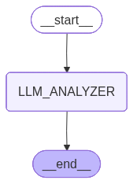

 AI Code Complexity Analyzer Agent

A production-ready AI agent built using LangGraph + Ollama  that analyzes source code and provides:

- Time Complexity
- Space Complexity
- Optimization Suggestions
- Real-World Use Cases

Includes:
- Structured output validation
- Graph mermaid
- Execution tracing
- Persona + Context + Knowledge design

 Agent Use Cases

This agent can be used for:

1. Interview Preparation
2. Code Review Automation
3. Production System Optimization
4. Learning & Teaching Tool
5. AI Observability Experiments

 Architecture

User → LangGraph → LLM (Ollama Mistral) →  Validation → Trace Logging → Output JSON

 Architecture Diagram

 

 Tech Stack

- Python
- LangGraph
- LangChain
- Ollama (Mistral)
- dotenv

 System Requirements

- Python 3.10 or higher
- 8GB RAM minimum (recommended for local LLM)
- Ollama installed locally
- Mistral model pulled in Ollama

 Installation Guide

 Step 1: Clone Repository
 Step 2: Create Virtual Environment
  python -m venv venv
  venv\Scripts\activate
 Step 3: Install Dependencies
  pip install -r requirements.txt
 Step 4: Install Ollama
  ollama pull mistral
  ollama run mistral
 Step 6: Run the Agent
  python agent.py

